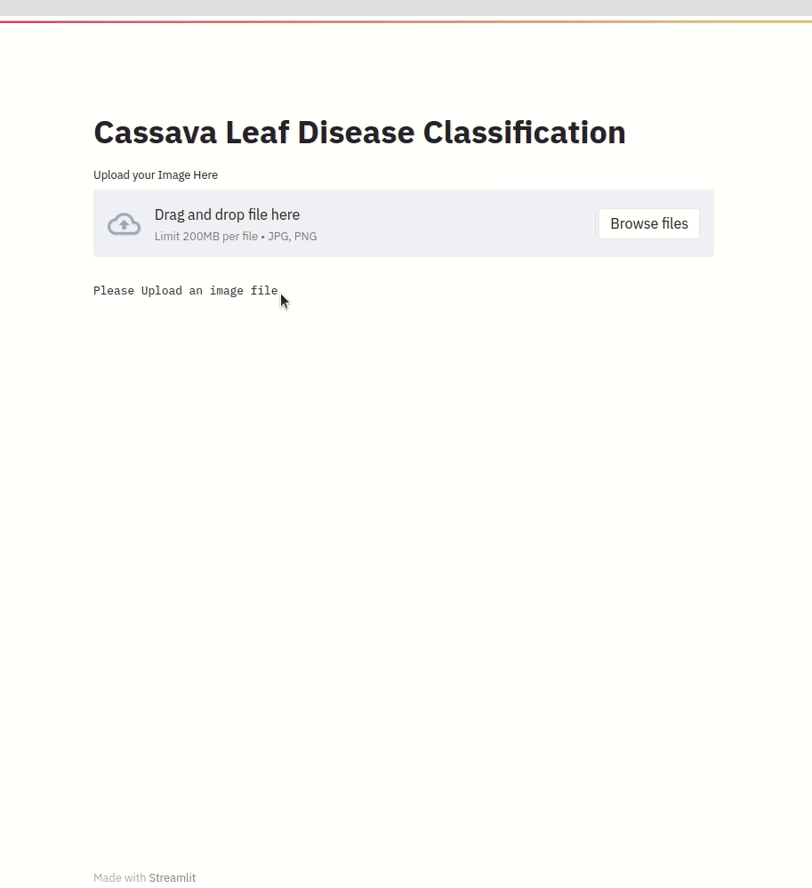

# Cassava leaf disease classification
[](https://pypi.org/project/cassava-classifier/)
[](https://pepy.tech/project/cassava-classifier)
The idea of this project is to build a Classifier Model to find the leaf disease type and it has almost 5 class and a im-balanced Class

- [Link to the competition](https://www.kaggle.com/c/cassava-leaf-disease-classification])
- [Github discussion forum😀](https://github.com/p-s-vishnu/cassava-leaf-disease-classification/discussions)


< Problem statement >

< leaf-diseases-GIF>


## Installation
`pip install cassava-classifier`


## Example inference

```python
import PIL import Image
from cassava.pretrained import get_model

image = Image.open("<insert your image path here>")

# Use cassava.list_models() to see list of all available pretrained models with metrics
model = get_model(name:str)
model.predict_as_json(image: np.array)
>> [{"class_name":str, "confidence": float}]

```
# Our Pipeline
    1.Model Architecture - Efficeientnet-B4 , Noisy Weights
    2.Image Size         - 512
    3.Optimizer          - Adam
    4.Scheduler          - GradualWarumUpScheduler
    5.Loss               - Focal Cosine Loss
    6.Augmentations      - Hard Augmentations
    7.Epochs             - 10
    8.Early Stopping     - No
    9.Mixed Precision    - Yes

Try Jupyter notebook in Google Colab: [](https://colab.research.google.com/drive/1gPLY6nqF6P4WdvIRIAH_aYQn-iWkzvqs?usp=sharing)

Try Jupyter notebook in Kaggle: [](https://www.kaggle.com/vpkprasanna/cassava-inference-from-pypi)

## Training

> Hyperparameters are defined in the config file.


### Prepare data


### Edit configurations


### Run train script


## Inference




## Web app

< Web app GIF>

[Heroku Link]()

[AWS link]()

[Code for Web app]( )


## Blog

[Medium link]()


## Acknowledgements

We would like to thank Kaggle community as a whole for providing an avenue to learn and discuss latest data science/machine learning advancements but a hat tip to whose code was used / who inspired us.

1. Teranus
2. Nakama

- - - -
<a href="https://www.buymeacoffee.com/vpkprasanna" target="_blank"></a>

Copyright © 2021 Prasanna Kumar. All rights reserved
